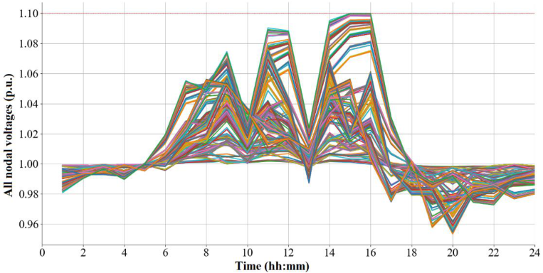

# Evaluation of Solar Panel Integration in Power Control Distribution
 Networks

**Toaza, Jimmy[1,*]** **; Pazmiño, Edwin[2]** **; Quinatoa, Carlos[1]** **; Salazar, Roberto[1]**

_1Universidad Técnica de Cotopaxi, Facultad de Ciencias de la Ingeniería y Aplicadas, Latacunga, Ecuador_

_2Universidad Técnica de Cotopaxi, Departamento de Ingeniería, Latacunga, Ecuador_

**Abstract:** The reduction of greenhouse gases, such as CO2, has led countries to adopt measures to reduce their
environmental impact, according to the goals of the 2030 agenda. As a result, changes in the operation and planning
of electricity systems and distribution networks are taking place, which have had to adapt to the incorporation of nonconventional renewable energies, such as photovoltaic. The integration of these technologies generated problems such
as voltages outside the allowed limits, fluctuations, overloads, reverse flows, sympathetic tripping and an increase in
fault currents, making it necessary to evaluate the percentage of renewable energies that can be safely integrated. This
research evaluated the integration capacity of solar panels in the distribution network of primary and secondary lines
using OpenDSS in the Chimbo feeder of the Guaranda substation of the Bolivar CNEL EP business unit. Two
methodologies are presented: the first one evaluates the maximum input capacity of solar panels in percentage terms,
and the second one implements a reactive power-voltage control using an optimization model. The results showed that,
with the first methodology, the maximum integration limit was 48%, while the second methodology allowed the
integration of 100% of the solar panels, without exceeding the power quality limits established by national regulations.

**Keywords: Photovoltaic panels, voltage profile, electrical distribution, electrical demand, solar irradiation**

# Evaluación de Integración de Paneles Solares en Redes de
 Distribución para Control de Potencia

**Resumen: La reducción de gases de efecto invernadero, como el CO2, ha llevado a los países a adoptar medidas para**
reducir su impacto ambiental, de acuerdo con los objetivos de la agenda 2030. Como consecuencia, se están
produciendo cambios en la operación y planificación de los sistemas eléctricos y las redes de distribución, que han
tenido que adaptarse a la incorporación de energías renovables no convencionales, como la fotovoltaica. La integración
de estas tecnologías generó problemas como tensiones fuera de los límites permitidos, fluctuaciones, sobrecargas,
flujos inversos, disparos por simpatía y aumento de las corrientes de falla, haciendo necesario evaluar el porcentaje de
energías renovables que pueden ser integradas de forma segura. En esta investigación se evaluó la capacidad de
integración de paneles solares en la red de distribución de líneas primarias y secundarias utilizando OpenDSS en el
alimentador Chimbo de la subestación Guaranda de la unidad de negocio Bolívar CNEL EP. Se presentan dos
metodologías: la primera, evalúa la capacidad máxima de aporte de los paneles solares en términos porcentuales, y la
segunda implementa un control de potencia reactiva-tensión utilizando un modelo de optimización. Los resultados
mostraron que, con la primera metodología, el límite máximo de integración era del 48%, mientras que la segunda
metodología permitía la integración del 100% de los paneles solares, sin superar los límites de calidad de energía
establecidos por la normativa nacional.

**Palabras clave: Paneles fotovoltaicos, perfil de tensión, red de distribución, demanda eléctrica, irradiación solar**

**11. INTRODUCTION**

The constant evolution of technology and the commitment to
reduce greenhouse gas emissions to meet the 2030 diary
(CEPAL, 2018), have made photovoltaic panels more efficient
and economical. To start with, the Agency for the Regulation

*jimmy.toaza1062@utc.edu.ec
Recibido: 02/07/2024
Aceptado:16/12/2024
Publicado en línea: 31/12/2024
[10.33333/rp.vol54n3.07](https://doi.org/10.33333/rp.vol54n3.07)
[CC 4.0](https://creativecommons.org/licenses/by-nc-sa/4.0/)

and Control of Non-Renewable Energy and Natural Resources
ARCERNNR approves resolution No. ARCERNNR001/2021 corresponding to the Regulatory Framework of
Distributed Generation for self-supply of regulated consumers
of electrical energy (ARCERNNR, 2021). Therefore, there is
a high probability that regulated and non-regulated users

Revista Politécnica Diciembre 2024 Vol 54 No 3

-----

install photovoltaic panels along the feeder and problems such
as: overvoltage, unbalances, harmonics, flows in two
directions, sympathetic tripping, increased levels appear. short
circuit, among others.

Currently, this document evaluates the power input of
photovoltaic panels through two methodologies that help the
analysis of voltages in the nodes, power through the lines and
currents in the electrical distribution network of the GuarandaChimbo feeder of the Guaranda substation belonging to CNEL
EP BOLIVAR in order to control the massive input of
photovoltaic panels in compliance with the integral regulation
for the distribution and commercialization of electrical energy
in the country No. ARCERNNR-002/20.

Through this study, it is intended to analyze in depth the
problems that the electrical network has when there is a
massive entry of photovoltaic panels into the Chimbo feeder,
being renewable energies these help to protect the environment
and its ecosystem, since, if distributed photovoltaic or
conventional generation mainly thermal power plants will
decrease and reduce greenhouse gas or CO2 emissions, except
for the introduction of solar cells, as well as help reduce
technical losses in the electrical distribution network.

To address the problem of massive entry of photovoltaic
generators into the electrical grid, they carry out a hosting
capacity theorem to determine the amount of photovoltaic
generation capacity distributed for each client with security
and protection (Khomarudin et al. 2022), this Capacity
Methodology Lodging consists of installing Photovoltaic in
client to client with the maximum capacity without exceeding
the limit of the system. However, as the photovoltaic panels
depend on the solar irradiation that is variable during the day
and weather conditions in Kahrobaee et al. (2020) proposes a
probabilistic approach to determine the impact of the reduction
of photovoltaic energy on the improvement of the
accommodation capacity of a distribution circuit in different
integration locations.

Today, there are efforts by electric distribution companies to
determine the accommodation capacity in their networks in
Niederhuemer et al. (2015) they carry out a probabilistic
planning approach that increases the accommodation capacity
of photovoltaic energy while accepting an active power
reduction, performed with the P(U) control of the photovoltaic
inverter, for short periods of time. Ebe et al. (2017) compare
different methods for assigning future photovoltaic capacity
based on analysis of solar potential at the distribution system
level. Rule-based methods are developed and compared with a
probabilistic method, which is repeated several times as a
Monte Carlo analysis.

Likewise, to determine the allocation of photovoltaic power to
the grid nodes, Bhusal et al. (2019) propose a stochastic
method to calculate the distributed generation accommodation
capacity for photovoltaic panels while guaranteeing that no
voltage requirements are violated, the proposed method takes
electric vehicle charges into account. As photovoltaic panels
power electronics as an interface to connect to the electrical
network in Nakhodchi et al. (2021) proposes a new approach

to estimate a safe accommodation capacity in terms of
harmonic distortion, considering standard limits for harmonic
voltages and currents. It is shown that triple harmonics and
seven harmonics are the harmonic orders that determine the
total accommodation capacity. Likewise, electrical
distribution networks consist of primary and secondary
networks. Navarro et al. (2021) developed a methodology to
determine the photovoltaic solar energy hosting capacity of a
distribution network, considering the interactions between
medium-voltage (MV) and low-voltage (LV) networks at
different voltage levels. Their approach included detailed LV
network modeling features for a comprehensive analysis. A
novel solution to calculate hosting capacity based on network
congestion risk. In addition to the classical voltage and current
constraints, the proposed approach also integrates the
stochastic allocation of distributed generation and separately
assesses its impact on the value of hosting capacity. In
Ezzeddine et al. (2021) he proposes a topology agnostic
estimation method for the PV hosting capacity of distribution
networks, this method uses the strength of the direct path from
the slack bus to the customer and an assumed topology to avoid
a complete knowledge about the network topology. Using an
assumed topology, an estimate of the minimum surge carrying
capacity for each penetration level and the transformer surge
carrying capacity is obtained for any combination of customers
having PV panels. The inclusion of solar panels requires
mathematical optimization models or in this sense in
Alrushoud et al. (2020) proposes a PV allocation method based
on the optimal capacity to evaluate the PV hosting capacity,
Firstly, we use the load allocation method to assign realistic
load profiles to each charging node up to each household,
instead of randomly assigning the PV installed capacity to
each household, secondly, the optimal PV size for each
household is calculated. based on annual load profiles.

Wang et al. (2016) propose a maximum accommodation
capacity evaluation method taking into account the optimal
and robust operation of on-load tap changers (OLTC) and
static var compensators in the uncertain context of power
outputs from distributed generation and load consumption. In
Hassan et al. (2022) a new multi-stage algorithm is developed
based on an analytical approach and an optimal power flow for
the evaluation of the hosting capacity of distributed renewable
generation. In the first stage, the optimal locations of the
distributed renewable generation are determined analytically,
and the second stage involves the calculation of the optimal
sizes of the distributed renewable generation for the evaluation
of the optimal accommodation capacity.

The reviewed investigations do not address the control
strategies of inverters and voltage regulators for the large-scale
integration of renewable energy sources into electrical
distribution networks. The entrance of the photovoltaic panels
to the electrical distribution network is of a random nature due
to the variability of the primary energy and the uncertain
knowledge of the installation of the users. This causes the
analysis to be performed using stochastic methods.

Regarding our investigation, it is proposed to evaluate the state
variables of the system with the entry of photovoltaic panels
using the random method of load profiles and solar irradiation

-----

and after that a strategy is carried out control in the voltage
power inverter with a method of mathematical optimization.
For this, the OpenDSS software will be used, which allows
modeling the electrical distribution network (Ochoa, 2015)
and the python platform for the interface and data management
(Hariri, 2017) together with Pyomo and the solver knitro.

The rest of this document is organized as follows. Then, it
presents the general data of the Guranda - Chimbo feeder of
the company CNEL - BOLIVAR is presented. Subsequently,
the methodology used is explained. Then the results and
discussion are presented. Finally, additional information to be
considered is detailed, after which conclusions and
recommendations are presented.

**2. METHOD**

This research adopts a quantitative and explanatory approach
to analyze the state variables of the electrical distribution
network before the entry of photovoltaic panels. To achieve
this, the deductive method that helps to obtain knowledge by
developing applications or concrete consequences from
general principles was taken.

_2.1_ _Methodology 1_

The integration of photovoltaic panels for each user is
evaluated stochastically using the Monte Carlo method to
assess the maximum power capacity injected into the network.
The implemented methodology is illustrated in Figure 1.

This figure explains the methodology for the entry of
photovoltaic panels into the electrical distribution network. As
a first step, the modeling of the primary and secondary lines,
transformers, demand, fuses, etc. This is done in the openDSS
format, for which we have the map in ArcGIS of the Guaranda

- Chimbo feeder.

Previously, the python vs openDSS interface is created, for
them a master.dss file is created that contains all the network
modeling and the ODSSfunction file which includes all the
functions required for the interface and execution from
Jupyter. Once the two previous steps have been completed, we
proceed to execute the power flow to see if the program is
modeled correctly, if this is the case, we proceed to verify the
voltages, if not, we proceed to verify the modeling in
openDSS.

This step is important because the voltages must match those
of the real system. Once it has been verified that the
implemented system is the same as real and that the voltages
are within the range of +- 10%, 25% of the photovoltaic panels
are entered into the feeder, this is to randomly install 1721
users of the total number of 6887, successively with each
percentage.

Once again, the power flow is executed and it is verified if it
complies with the lower and upper voltage limits, if it
complies, the process is finished, otherwise the state variables
are verified, that is, voltage in the nodes, currents in the lines,
over voltages in the transformers.

This process is repeated for each integration percentage, as
illustrated in Figure 1. Using the proposed methodology, the
amount of distributed energy resources from photovoltaic
panels that can be connected to the grid without causing
instability in the system or violating security regulations is
determined.

**Figure 1. Methodology 1**

_2.2_ _Methodology 2_

Renewable energy sources, such as photovoltaic generation
and small run-of-the-river hydroelectric plants, use power
converters to connect to the grid and extract maximum power.

Revista Politécnica Diciembre 2024 Vol 54 No 3

-----

However, there are three types of control modes for managing
the energy generated by the photovoltaic panel, these modes
depend on the characteristics of the electrical distribution
network.

  - Centralized control

  - Distributed cooperative control

  - Decentralized control.

The centralized control and the distributed cooperative use
communication networks with a large bandwidth to be able to
control from a control room which makes it unfeasible in
practical applications due to cost. On the other hand, the
decentralized control is local and dispatches power in each
photovoltaic inverter based on instantaneous local
measurements (Cheng, 2020). Therefore, due to its costeffectiveness and benefits, we will propose decentralized
control.

The following Equations are used to control the active power
and reactive power in the inverter of each photovoltaic panel
through a nonlinear optimization model:

(1)

minz: ∑𝑡∈𝑇 ∑𝑝𝑣∈𝑝𝑣𝑠 −𝑃conpvt + 𝛼[1] [tan (𝜙)][conpvt ]

Subject to:

𝑝𝑖𝑠 is the active power injected for each of the phases.

𝑞𝑖𝑠 is the reactive power injected for each of the phases.

𝑃𝑔𝑝𝑣𝑠 is the active power of the photovoltaic panel for each of

the phases.
𝑄𝑔𝑝𝑣𝑠 is the reactive power of the photovoltaic panel for each

of the phases.
𝑝𝑧𝑗𝑠 is the constant impedance active demand for each of the

phases.
𝑞𝑧𝑗𝑠 is the constant impedance reactive demand for each of the

phases.
𝑝𝐼𝑖𝑠 is the active constant current demand for each of the phases.

𝑞𝐼𝑖𝑠 is the constant current reactive demand for each of the

phases.
𝑝𝑝𝑖𝑠 is the constant active power demand for each of the phases.

𝑞𝑝𝑖𝑠 is the constant reactive power demand for each of the

phases.
𝑃𝑠𝑝𝑝𝑣 is the solar power profile obtained through solar
irradiation.
𝑃𝑐𝑜𝑛𝑝𝑣 active power control variable of the photovoltaic panel.
tan (𝜙)𝑐𝑜𝑛𝑝𝑣 reactive power control variable of the
photovoltaic panel.
𝛼 factor for reactive power control that must be greater than 1.

**3. RESULTS**

The evaluation of the methodological proposal detailed in
Section II is conducted on the Guaranda–Chimbo feeder,
which belongs to CNEL-BOLIVAR.

_3.1_ _Results and discussion of methodology 1_

Methodology 1 is ideal for studying the integration of
photovoltaic panels into the electrical distribution network.
This approach does not include voltage regulation control,
allowing an evaluation of the maximum percentage of
integration the network can accommodate without exceeding
upper voltage limits.

Therefore, it is carried out in the Guranda Chimbo feeder,
which consists of 6887 users, the loads of each user are taken
as a ZIP polynomial model, and they were modeled in a
monophasic way because they are unbalanced loads. However,
the demand profile and solar irradiation enter randomly in the
declared loads. Therefore, being a large system, it is not
possible to graph all the nodes, so only 30 random nodes
shrink. The simulation is carried out for 30 days.

Figure 2 shows the voltage profile with 48% integration of
photovoltaic panels for day 2, revealing that some nodes
exceed the upper voltage limit. This means that no
photovoltaic panels can be entered in those nodes that exceed
the voltage limits. In the same way, the Figure 3 on day 12
presents higher voltages in some nodes for that charge and
irradiation profile. However, for the remaining days they
present similar characteristics.

𝑝𝑖𝑠 = 𝑔𝑖𝑖𝑣𝑖2 + ∑𝑖≠𝑗 𝑔𝑖𝑗𝑣𝑖𝑣𝑗cos (𝛿𝑖𝑗)

+ ∑𝑖≠𝑗 𝑏𝑖𝑗𝑣𝑖𝑣𝑗sin (𝛿𝑖𝑗)

(2)

𝑞𝑖𝑠 = −𝑏𝑖𝑖𝑣𝑖2 + ∑𝑖≠𝑗 𝑔𝑖𝑗𝑣𝑖𝑣𝑗sin (𝛿𝑖𝑗)

(3)
−∑𝑖≠𝑗 𝑏𝑖𝑗𝑣𝑖𝑣𝑗cos (𝛿𝑖𝑗)

2

)

2

𝑠

+ 𝑝𝐼𝑖𝑠 ( 𝑣𝑛𝑜𝑚𝑖[𝑣][𝑖]

𝑠

+ 𝑞𝐼𝑖𝑠 ( 𝑣nomi [𝑣][𝑖]

) + ğ‘ğ‘ğ‘–ğ‘  ] (4)

) + ğ‘ğ‘ğ‘–ğ‘  ] (4)

𝑠

𝑝𝑖𝑠 = 𝑃𝑔𝑝𝑣𝑠 −[𝑝𝑧𝑗𝑠 ( 𝑣𝑛𝑜𝑚𝑖[𝑣][𝑖]

𝑠

𝑞𝑖𝑠 = 𝑄𝑔𝑝𝑣𝑠 −[𝑞𝑧𝑗𝑠 ( 𝑣𝑛𝑜𝑚𝑖[𝑣][𝑖]

)

𝑃𝑔𝑝𝑣𝑠 = 𝑃𝑠𝑝𝑝𝑣𝑃𝑐𝑜𝑛𝑝𝑣 (5)

𝑄𝑔𝑝𝑣𝑠 = 𝑃𝑔𝑝𝑣𝑠 tan (𝜙)𝑐𝑜𝑛𝑝𝑣 (6)

−tan (acos (𝜙𝑚𝑖𝑛)) ≤tan (𝜙)conpv ≤0 (7)

√𝑃𝑔𝑝𝑣2 + 𝑄𝑔𝑝𝑣2 ≤𝑆𝑖𝑛𝑣𝑝𝑣 (8)

𝑣mini ≤𝑣𝑖𝑠 ≤𝑣max𝑖 (9)

Where:
_s_ ∈ _Ω belongs to the set of phases (a, b, c)._
_i, j_ ∈ _σ belongs to the set of nodes._
_t_ ∈ _T belongs to simulation time._

-----

**Figure 2. Voltage profile with photovoltaic panels at 48%**

**Figure 3. Voltage profile with photovoltaic panels**

_3.2_ _Methodology 2 feeder Guaranda Chimbo_ Figure 4 illustrates the integration of photovoltaic panels at

100%, showing that the voltages remain within the limits

With Methodology 2, 100% of photovoltaic solar panels can allowed by the regulations. Figure 5 shows the current of the
be entered and the voltage can be controlled to a maximum of three phases at the beginning of the substation, where it shows
1.10 in per unit using the previously presented mathematical us that the current is also limited when the reactive poweroptimization model. This mathematical model contains 77232 voltage control is carried out.
variables and 104352 constraints. It is solved with the knitro
solver that is used to solve non-linear problems such as
unbalanced power flow in electrical distribution networks.

Revista Politécnica Diciembre 2024 Vol 54 No 3

-----

**Figure 4. Entry of photovoltaic panels at 100% and the voltages**

**Figure 5. Current flow in the network**

Figure 6 illustrates the power flow through the line near the Figure 7 illustrates the power control performed by the
Guaranda substation. During hours of high solar incidence, the optimizer, which operates from 9:00 a.m. to 4:00 p.m. when
flow becomes negative, meaning that power flows from the solar incidence limits the delivery of additional power to the
photovoltaic panels toward the substation. Conversely, during network, ensuring compliance with the voltage profile within
hours of low solar incidence, the flow moves from the regulatory standards.
substation toward the loads. Finally, Figure 8 illustrates the reactive power control variable

of the photovoltaic panel tan(ϕ), this helps to keep the voltage
within the allowed limit +- 10%.

**Figure 6. Power flow network**

-----

**Figure 7. Power control**

**Figure 8. Reactive power control variable of the photovoltaic panel tan(ϕ)**

**4. CONCLUSION**

Methodology 1 is deemed adequate for assessing the
integration of photovoltaic panels into the unbalanced
electrical distribution network, facilitating an understanding of
the permissible penetration percentage that can be
accommodated within this network while adhering to energy
quality regulations. Consequently, the upper integration limit
for the Guaranda–Chimbo feeder is determined to be 48%.

To achieve elevated percentages, we employ Methodology 2,
which effectively minimizes reactive power while
simultaneously maximizing the active power output of each
photovoltaic panel, all in accordance with the constraints
imposed by power balance, as well as the minimum and
maximum operational parameters of the electrical system and
photovoltaic panels in conjunction with their respective
inverter. Through the application of this methodology, it has
been feasible to integrate 100% compliance with the stipulated
voltage profile. Nevertheless, the occurrence of reverse power
flow has been noted, which results in the inappropriate
activation of protective mechanisms within the electrical
feeder system.

_ACKNOWLEDGMENT_
We thank CNEL - EP Bolivar for the data provided to carry
out this investigation.

**REFERENCES**

Alrushoud, A. &. (2020). Impacts of PV capacity allocation

methods on distribution planning studies. _IEEE/PES_
_Transmission_ _and_ _Distribution_ _Conference_ _and_
_Exposition (T&D) (pp. 1-5). Chicago: IEEE._
ARCERNNR, Agencia de Regulación y Control de

Electricidad. (2021, 5 de abril). Marco normativo de la
_generación distribuida para autoabastecimiento de_
_consumidores_ _regulados_ _de_ _energía_ _eléctrica._
ARCERNNR.
https://www.controlrecursosyenergia.gob.ec/wpcontent/uploads/downloads/2023/11/Regulacion-Nro.ARCERNNR-008-23-signed1.pdf
Bhusal, N. K. (2019). Photovoltaic hosting capacity estimation

considering the impact of electric vehicles. In IEEE
(Ed.), _IEEE Industry Applications Society Annual_
_Meeting_ (pp. 1-6). Baltimore: IEEE.
https://doi.org/https://doi.org/10.1109/IAS.2019.89124
03
CEPAL, Comisión Económica para América Latina y el

Caribe. (2018). _Agenda 2030 y los objetivos de_
_desarrollo sostenible: una oportunidad para América_
_Latina_ _y_ _el_ _Caribe._ CEPAL.
https://repositorio.cepal.org/server/api/core/bitstreams/
cb30a4de-7d87-4e79-8e7a-ad5279038718/content

Revista Politécnica Diciembre 2024 Vol 54 No 3

-----

Chavarría, I. J. (2015). Control de inversor fotovoltaico para

redes eléctricas inteligentes (PhD thesis). Yucatan.
Ebe, F. I. (2017). Evaluation of PV hosting capacity of

distribution grids considering a solar roof potential
analysis — Comparison of different algorithms. In 2017
IEEE Manchester PowerTech. _IEEE Manchester_
_PowerTech_ (pp. 1-6). Manchester: IEEE.
https://doi.org/https://doi.org/10.1109/PTC.2017.79810
17
Ezzeddine, K. &. (2021). A topology agnostic estimation

method for PV hosting capacity of distribution grids. In
IEEE (Ed.), IEEE Madrid PowerTech (pp. 1-6). Madrid:
IEEE.
https://doi.org/https://doi.org/10.1109/PowerTech4664
8.2021.9495046
Hariri, A. N. (2017). Open-source Python-OpenDSS interface

for hybrid simulation of PV impact studies. _IET_
_Generation, Transmission & Distribution, 2(12), 3125-_
3133. https://doi.org/https://doi.org/10.1049/ietgtd.2016.1572
Hassan, S. J.-H. (2022). Maximum hosting capacity

assessment of distribution systems with multitype DERs
using analytical OPF method. _IEEE, 10(1), 100665-_
100674.
https://doi.org/https://doi.org/10.1109/ACCESS.2022.3
207488
Kahrobaee, S. &. (2020). Probabilistic analysis of PV

curtailment impact on distribution circuit hosting
capacity. _2020 47th IEEE Photovoltaic Specialists_
_Conference (PVSC) (pp. 2210-2213). Calgary: IEEE._
https://doi.org/https://doi.org/10.1109/PVSC45281.202
0.9300440
Khomarudin, R. B.-N. (2022). Mathematical hosting capacity

calculation due to arise voltage using the equation of line
approach. _022 5th International Conference on Power_
_Engineering and Renewable Energy (ICPERE) (pp. 1-_
6). Bandung: IEEE.
https://doi.org/https://doi.org/10.1109/ICPERE56870.2
022.10037500
Nakhodchi, N. &. (2021). Estimation of safe harmonic hosting

capacity. _CIRED 2021 - The 26th International_
_Conference and Exhibition on Electricity Distribution_
(pp. 693-697). IEEE.
https://doi.org/https://doi.org/10.1049/icp.2021.1818
Navarro, B. B. (2021). A comprehensive solar PV hosting

capacity in MV and LV radial distribution networks.
_IEEE PES Innovative Smart Grid Technologies_
_Conference Europe (ISGT-Europe) (pp. 1-6). Turin:_
IEEE.
https://doi.org/https://doi.org/10.1109/ISGTEurope.201
7.8260210
Niederhuemer, W. &. (2015). Increasing PV hosting capacity

in LV grids with a probabilistic planning approach.
_International Symposium on Smart Electric Distribution_
_Systems and Technologies (EDST) (pp. 537-540)._
Vienna: IEEE.
https://doi.org/https://doi.org/10.1109/SEDST.2015.73
15266
Ochoa, L. N.-T. (2015). _Advanced modelling of smart_

_distribution_ _networks_ _using_ _OpenDSS._ IEEE.
https://www.researchgate.net/profile/Luisnando

Ochoa2/publication/283453198_Tutorial_ISGT_Latin_Ameri
ca_2015_Advanced_Modelling_of_Smart_Distribution
_Networks_Using_OpenDSS/links/5638aa2208ae51cc
b3cc831f/Tutorial-ISGT-Latin-America-2015Advanced-Modellin
Wang, S. C. (2016). Distributed generation hosting capacity

evaluation for distribution systems considering the
robust optimal operation of OLTC and SVC. _IEEE_
_Transactions on Sustainable Energy, 7(3), 1111-1123._
https://doi.org/https://doi.org/10.1109/TSTE.2016.2529
627

**BIOGRAPHIES**

**Jimmy, Toaza Iza, graduated in**
Mechanical Engineering from
the Escuela Politécnica Nacional
“EPN” in 2011, and its Master's
degree in Quality, Safety and
Environment by the Universidad
Central del Ecuador. He
currently works as a teacher at
the Technical University of
Cotopaxi and its fields of
research is related to
“Renewable resource technology and environmental care”

**Edwin, Pazmiño Gavilanes,**
graduated in Electrical
Engineering from the
Universidad Técnica de
Cotopaxi, Master in Electricity
with a mention in Electrical
Power Systems from the
Universidad Técnica de
Cotopaxi, Resident of Electrical
Works, Electrical Projects
Engineer, Electrical Works
Supervisor and Project Contractor with companies Public
Distribution of Electrical energy within the country,
Manager of the Electrical Engineering and Construction
Company.

**Carlos,** **Quinatoa** **Caiza,**
engineer in Electrical Power
Systems from the Universidad
Técnica de Cotopaxi, Master in
Electrical Engineering Sciences
from the Universidad Tecnológica
de Pereira and Aspiring Doctor in
Electrical Engineering Sciences
from the Universidad Central de
Venezuela, studies carried out by
obtaining the German DAAD
scholarship, active member of the Institute of Electrical and
Electronics Engineers IEEE, junior researcher of the IEEE,
advisor of the IEEE-UTC Student Branch, coordinator of the

-----

Master's Degree in Electricity Mention in Electrical Power
Systems of the UTC, engineering research professor in
electricity and a master's degree in electricity from UTC.

**Roberto, Salazar, he was born in**
Latacunga, Ecuador, in 1988. He
received his degree in
Electromechanical Engineering

Fotografía from the Escuela Politécnica del
actualizada Ejército in 2011 and a Master in

del autor Applied Physics from the

Universidad Técnica de Ambato
in 2022, in addition to his Master
in Energy Management from the
Universidad Técnica de Cotopaxi.
He has experience in various fields of competitive robotics.
Currently, he is a non-tenured undergraduate professor at the
Technical University of Cotopaxi. His main fields of research
include simulation and modeling of physical phenomena,
renewable energies, energy quality, and efficiency.

Revista Politécnica Diciembre 2024 Vol 54 No 3

Fotografía
actualizada

del autor

-----

